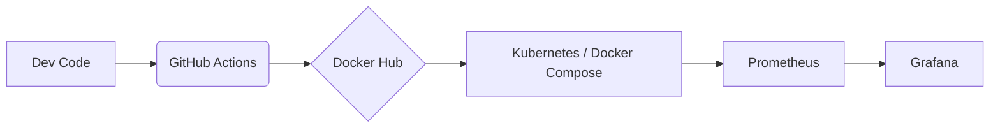

# 🚀 DevOps Monitoring Pipeline & Observability  


---

## 📋 Sobre o Projeto

Este projeto simula um ambiente real de DevOps, focando na automação do ciclo de vida de uma aplicação (CI/CD), orquestração de containers e monitoramento em tempo real.

O objetivo foi aplicar na prática os conceitos de:

- ✅ Imutabilidade  
- ✅ Infraestrutura como Código (IaC)  
- ✅ Observabilidade  

---

## 🏗️ Arquitetura da Solução

O fluxo de trabalho foi desenhado para garantir entregas rápidas e seguras:



---

## 🛠️ Tecnologias Utilizadas

- **Linguagem:** Python (Script de monitoramento de recursos)
- **Containerização:** Docker & Docker Compose
- **Orquestração:** Kubernetes (Manifestos de Deployment e Service)
- **CI/CD:** GitHub Actions (Automação de Build e Push)
- **Observabilidade:** Prometheus (Coleta) e Grafana (Visualização)
- **Versionamento:** Git & GitHub

---

## 📸 Evidências (Screenshots)

### 1️⃣ Pipeline de CI/CD (GitHub Actions)
Automação completa:
- Checkout do código  
- Build da imagem Docker  
- Push para o Registry  

### 2️⃣ Observabilidade (Grafana Dashboard)
Monitoramento em tempo real da saúde dos containers e uso de recursos:
- CPU  
- Memória  

---

## 🚀 Como Rodar o Projeto

### ✅ Pré-requisitos

- Docker instalado
- Docker Compose instalado

---

### 📌 Passo a Passo

### 1️⃣ Clone o repositório

```bash
git clone https://github.com/SEU-USUARIO/SEU-REPO.git
cd SEU-REPO
```

### 2️⃣ Suba o ambiente de Observabilidade (Local)

Utilizamos o Docker Compose para subir a stack do Prometheus e Grafana instantaneamente:

```bash
docker compose up -d
```

### 3️⃣ Acesse o Dashboard

Abra o navegador em:

```
http://localhost:3000
```

Login padrão:
```
admin / admin
```

---

## 🧠 Decisões Técnicas (Why?)

### 🐳 Por que Docker?
Para garantir que a aplicação rode exatamente igual no ambiente local e em produção, eliminando o problema clássico de:
> "Funciona na minha máquina."

---

### 🔄 Por que GitHub Actions?
Para eliminar o processo manual de build.  
Sempre que um código é enviado ao repositório, a imagem é recriada e publicada automaticamente.

---

### 📊 Por que Prometheus + Grafana?
Para ter visibilidade proativa do sistema.

Em vez de esperar o sistema falhar, monitoramos:
- Picos de CPU  
- Consumo de memória  
- Saúde dos containers  

Isso permite agir antes que ocorram problemas.

---

## 📞 Contato

Projeto desenvolvido por **Davi Arruda**.

🔗 LinkedIn:  
https://www.linkedin.com/in/davi-arruda-417053330/
